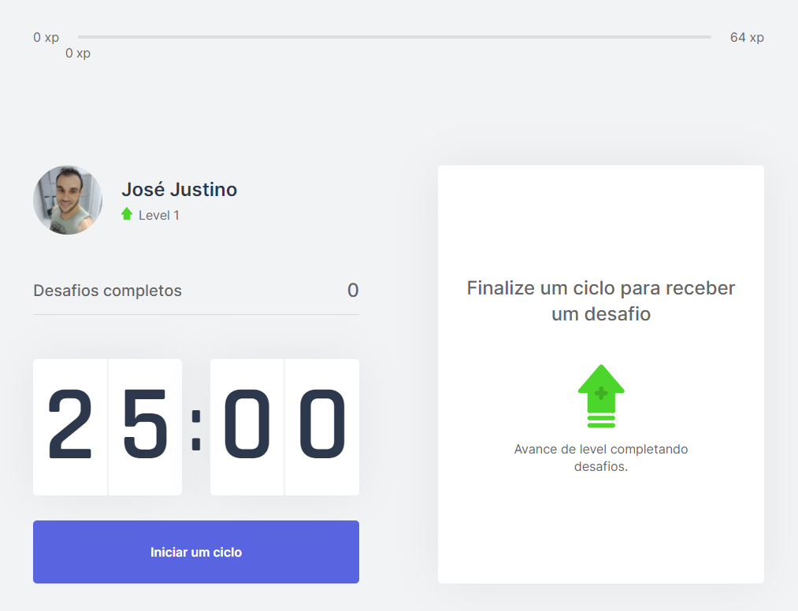
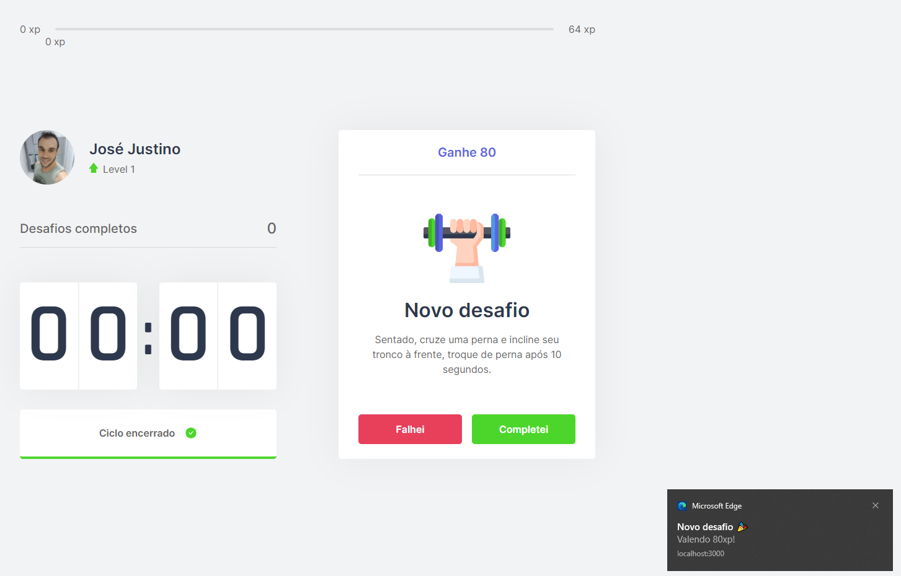
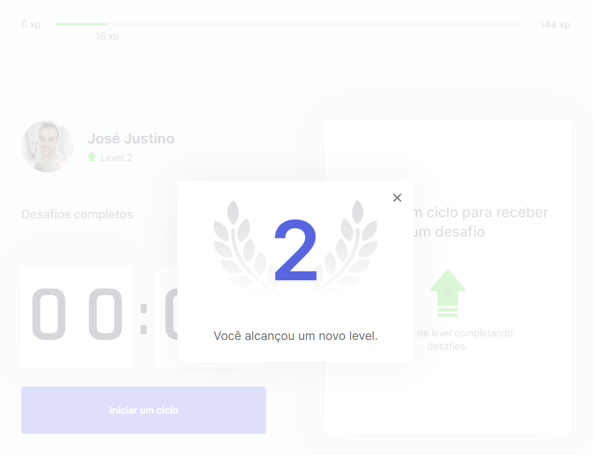
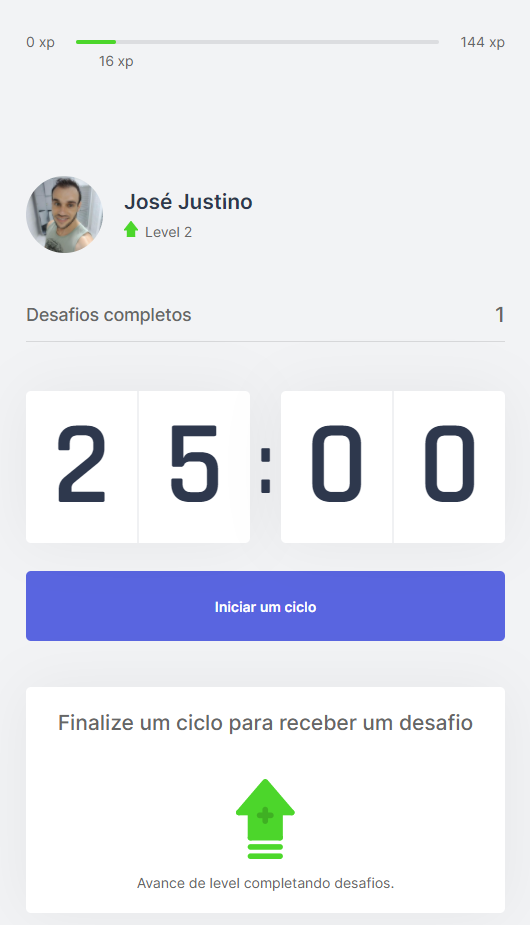

<h1 align="center">
    
</h1>

<p align="center">
 

  
</p>

<p align="center">
  <a href="#rocket-tecnologias">Tecnologias</a>&nbsp;&nbsp;&nbsp;|&nbsp;&nbsp;&nbsp;
  <a href="#-projeto">Projeto</a>&nbsp;&nbsp;&nbsp;|&nbsp;&nbsp;&nbsp;
  <a href="#-layout">Layout</a>&nbsp;&nbsp;&nbsp;|&nbsp;&nbsp;&nbsp;
  <a href="#-telas">Telas</a>&nbsp;&nbsp;&nbsp;|&nbsp;&nbsp;&nbsp;
  <a href="#-como-contribuir">Como contribuir</a>&nbsp;&nbsp;&nbsp;|&nbsp;&nbsp;&nbsp;
  <a href="#memo-licença">Licença</a>
</p>

## :rocket: Tecnologias

Esse projeto foi desenvolvido com as seguintes tecnologias:

- [React](https://reactjs.org)
- [Next](https://nextjs.org/)
- [Typescript](https://www.typescriptlang.org/)

## 💻 Projeto

O Move it é um projeto que visa ajudar o programador(a) a ter um ambiente de trabalho mais saudável, sugerindo exercícios a cada ciclo de 25 minutos, parecido com o ciclo pomodoro, mas com sugestões de exercícios para fazer durante os intervalos, e a cada ciclo completado com sucesso o usuário ganha XP para ir para o próximo nível.

## 🔖 Layout

Você pode visualizar o layout do projeto no formato através [desse link](https://www.figma.com/file/8zvp1Dw1suVo2CkIz4Ir9b/Move.it-1.0?node-id=160%3A2761). Lembrando que você irá precisar ter uma conta no [Figma](http://figma.com/).

## 🌆 Telas

<p align="center">
    
    
    
    
</p>

## ▶ Para rodar a aplicação

Antes de começar, instale o [Git](https://git-scm.com), [Node.js](https://nodejs.org/en/) e [Yarn](https://classic.yarnpkg.com/en/docs/install/#windows-stable) na sua máquina.<br>
Recomendo utilizar o terminal do [VSCode](https://code.visualstudio.com/).

> OBS: pode-se utilizar o gerenciador de pacotes npm ou o yarn para rodar os comandos abaixo

```bash
- Faça um clone do repositório: 
  $ git clone https://github.com/josejustino/move-it.git

- Acesse o repositório no seu terminal
  $ cd move-it

- Instale as dependências
  $ yarn install

- Execute o projeto
  $ yarn dev
  
- Acesse no browser de sua preferência via **localhost:3000**.
```

## 🤔 Como contribuir

- Faça um fork desse repositório;
- Cria uma branch com a sua feature: `git checkout -b minha-feature`;
- Faça commit das suas alterações: `git commit -m 'feat: Minha nova feature'`;
- Faça push para a sua branch: `git push origin minha-feature`.

Depois que o merge da sua pull request for feito, você pode deletar a sua branch.

**&copy;  [Rocketseat](https://rocketseat.com.br/)**

**Instrutor: [Diego Fernandes](https://github.com/diego3g) | CTO Rocketseat**

## :memo: Licença

Esse projeto está sob a licença MIT. Veja o arquivo [LICENSE](LICENSE.md) para mais detalhes.

---

<h4 align="center"> <em>&lt;/&gt;</em> by <a href="https://github.com/josejustino" target="_blank">josejustino</a> </h4>
